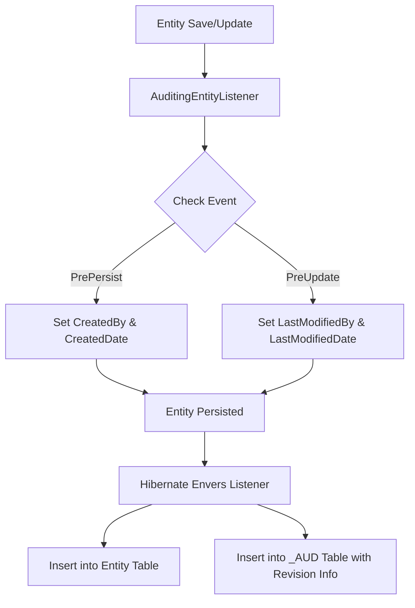

# Auditing in Spring Boot

Auditing in Spring Boot allows automatic population of certain fields such as:

- **Creation timestamp**
    
- **Modification timestamp**
    
- **User who created the entity**
    
- **User who last modified the entity**
    

---

## Steps to Enable Auditing

1. **Create Auditable Base Entity**
    
    - Use `@MappedSuperclass` to share fields across entities.
        
    - Add `@EntityListeners(AuditingEntityListener.class)` to enable auditing.
        
    - Use annotations:
        
        - `@CreatedBy`
            
        - `@CreatedDate`
            
        - `@LastModifiedBy`
            
        - `@LastModifiedDate`
            
2. **Extend Entities**
    
    - All entities that need auditing should extend the base class.
        
3. **Implement AuditorAware**
    
    - Create a class implementing `AuditorAware<T>` to provide the current authenticated user (from Spring Security or dummy value).
        
4. **Enable JPA Auditing**
    
    - Add `@EnableJpaAuditing` in a `@Configuration` class.
        
    - Pass reference of `AuditorAware` bean using `auditorAwareRef`.
        

---

## Example Implementation

### Base Entity

```java
@Getter
@Setter
@MappedSuperclass
@EntityListeners(AuditingEntityListener.class)
public class AuditableEntity {
    @CreatedDate
    @Column(nullable = false, updatable = false)
    private LocalDateTime createdAt;

    @CreatedBy
    @Column(nullable = false, updatable = false)
    private String createdBy;

    @LastModifiedDate
    private LocalDateTime lastModifiedAt;

    @LastModifiedBy
    private String lastModifiedBy;
}
```

### AuditorAware Implementation

```java
public class AuditorAwareImpl implements AuditorAware<String> {
    @Override
    public Optional<String> getCurrentAuditor() {
        return Optional.of("Adarsh Pandey"); // Later integrate with Spring Security
    }
}
```

### Configuration

```java
@Configuration
@EnableJpaAuditing(auditorAwareRef = "auditorAwareImpl")
public class AppConfig {
    @Bean
    public AuditorAware<String> auditorAwareImpl() {
        return new AuditorAwareImpl();
    }
}
```

---

## Internal Working of Auditing

- **Entity Lifecycle Events**
    
    - `@PrePersist` → `touchForCreate()` (sets created date & user).
        
    - `@PreUpdate` → `touchForUpdate()` (sets last modified date & user).
        
- **`AuditorAware`** provides information about the current user.
    

---

## Tracking Entity History with Hibernate Envers

### Dependency

```xml
<dependency>
    <groupId>org.hibernate</groupId>
    <artifactId>hibernate-envers</artifactId>
    <version>7.1.0.Final</version>
</dependency>
```

### Annotate Entity

```java
@Entity
@Table(name = "department")
@Audited
public class DepartmentEntity extends AuditableEntity {
    @Id
    @GeneratedValue(strategy = GenerationType.IDENTITY)
    private Long id;

    @Column(nullable = false)
    private String title;

    @OneToOne
    private EmployeeEntity manager;

    @OneToMany(mappedBy = "workerDepartment")
    private Set<EmployeeEntity> workers;
}
```

### How Envers Works

- Creates an additional table `<entity>_AUD`.
    
- Stores historical revisions of the entity.
    
- Each row includes:
    
    - **Revision ID**
        
    - **Timestamp**
        
    - **Entity state at that revision**
        

---

## Retrieving Revision History

```java
@RestController
@RequestMapping("/admin")
public class AuditController {
    @Autowired
    private EntityManagerFactory entityManagerFactory;

    @GetMapping("/employee/{employeeId}")
    public List<EmployeeEntity> getAllRevisions(@PathVariable Long employeeId) {
        AuditReader reader = AuditReaderFactory.get(entityManagerFactory.createEntityManager());
        List<Number> revisions = reader.getRevisions(EmployeeEntity.class, employeeId);

        return revisions.stream()
                .map(revision -> reader.find(EmployeeEntity.class, employeeId, revision))
                .collect(Collectors.toList());
    }
}
```

---

## Auditing Flow Diagram



---
